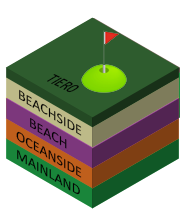

<h2>Spawnpoints</h2>

What is a spawnpoint?

<table>
<td></td>
<td>
A spawnpoint is a random location on the map where a "new" character will "spawn" into the game.  This area is governed by the Tier0 topology when painted via the editor.

<h3>FACTS</h3>
<ul>
  <li>Spawnpoints cannot happen in the Arctic Biome or on Snow</li>
</ul>
</td>
</table>

